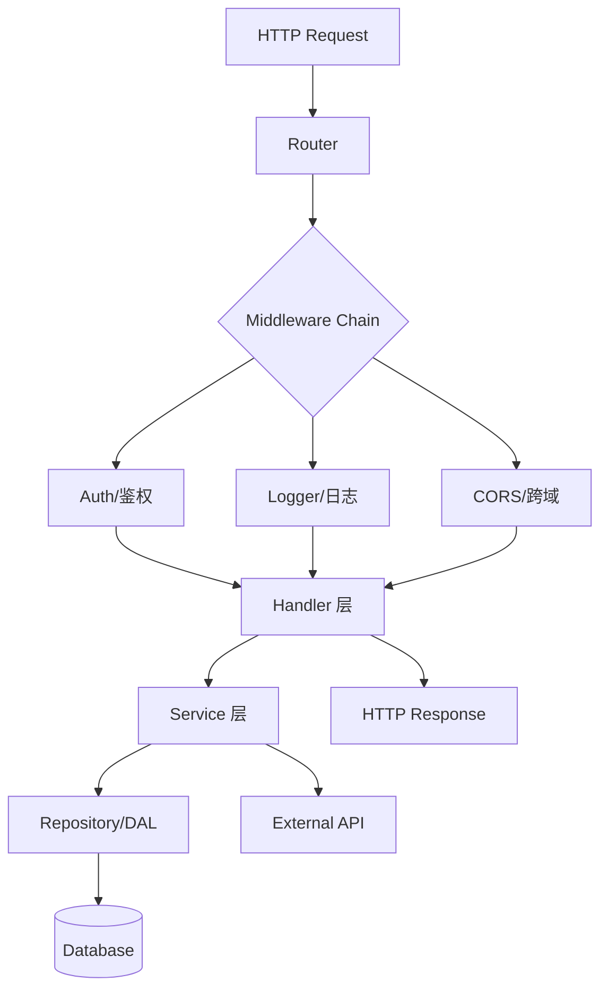
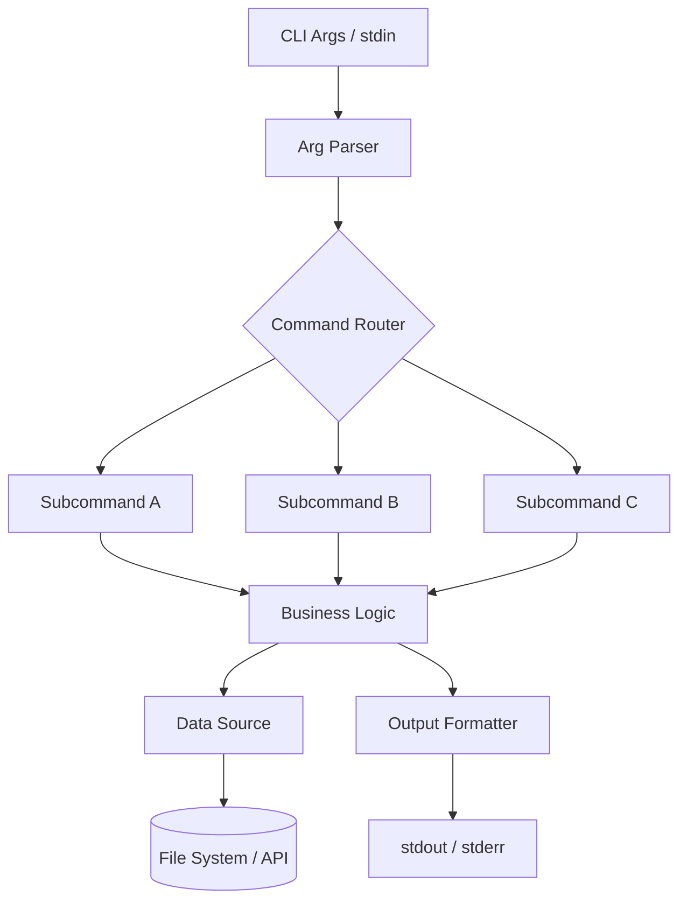
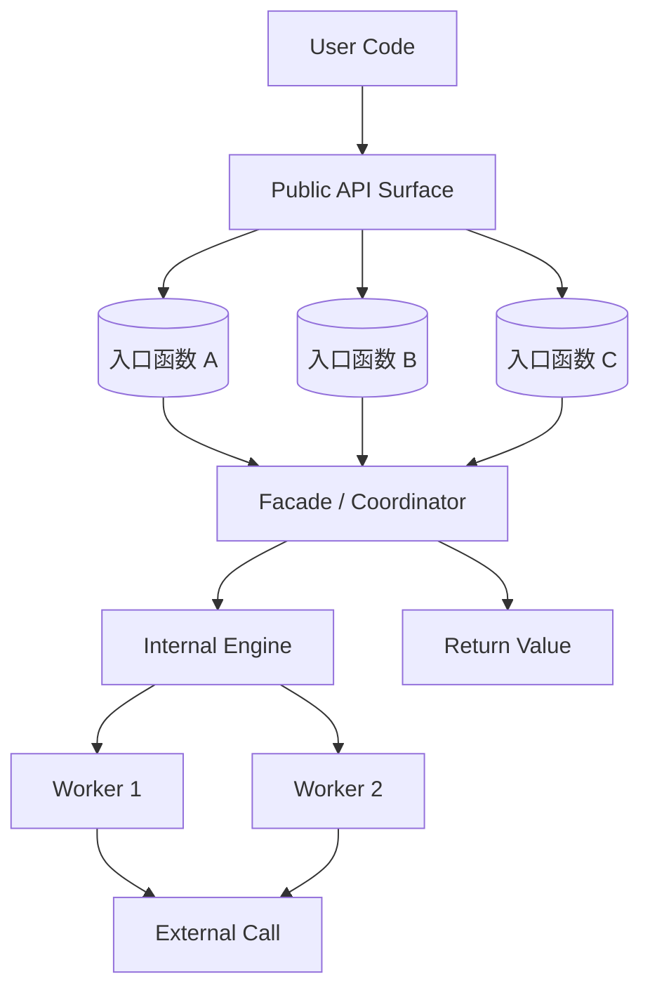
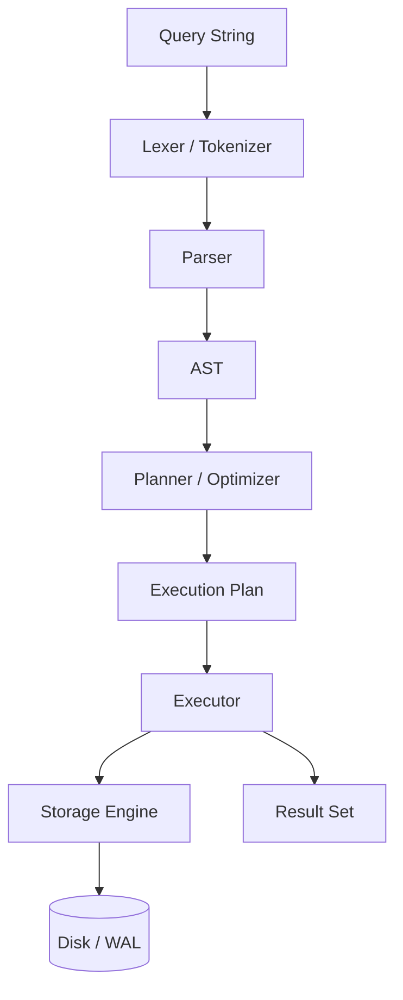
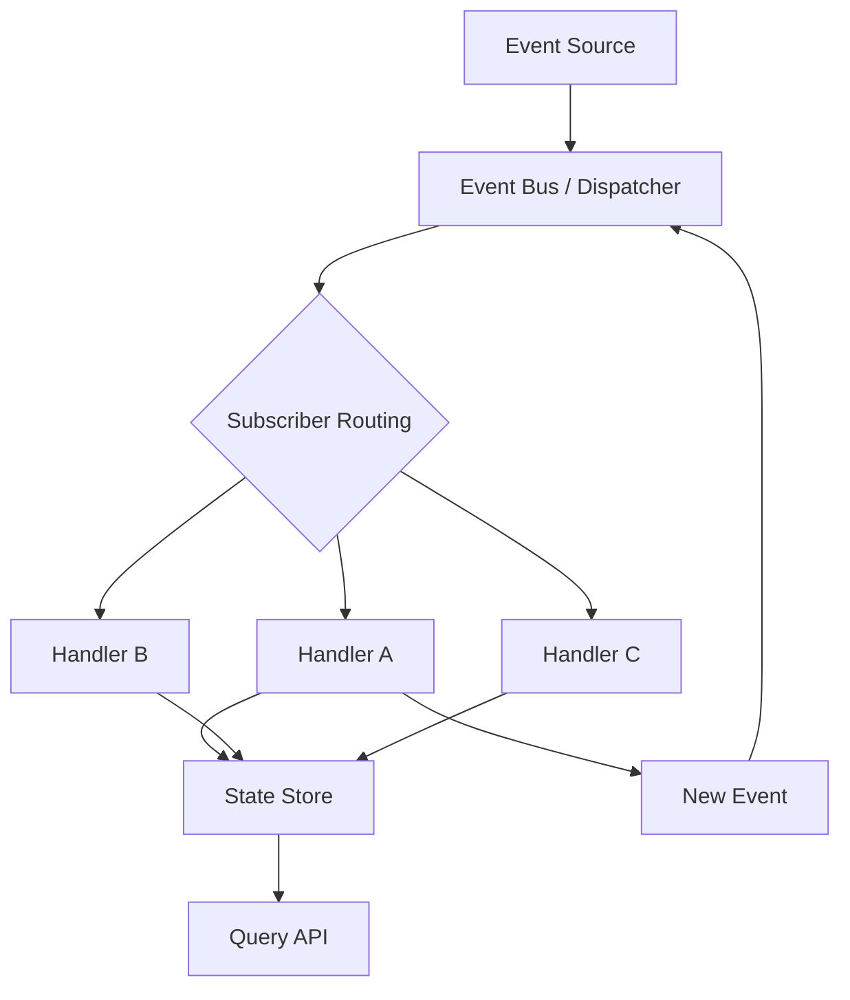
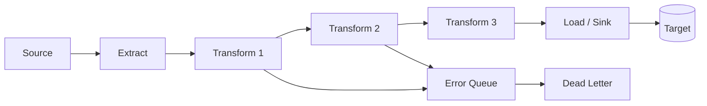

# 常见开源项目架构模式与 Mermaid 模板

不同项目类型有不同的架构模式和调用路径。使用正确的模式画 Mermaid 图，能让课程架构图更准确。

---

## 1. Web 框架 / 应用

**典型调用链路**：请求进入 → 路由匹配 → 中间件链 → 请求处理器 → 业务服务 → 数据访问层 → 响应返回

**切入点提示**：从路由注册文件开始（`router.go` / `routes.ts` / `urls.py`），找到所有暴露的端点，然后选一个最典型的端点向下追踪。

**关键特征**：
- 中间件通常形成洋葱模型（请求前 → `next()` → 响应后）
- 依赖注入在路由注册时完成
- 错误处理通常有全局 error handler

---

## 2. CLI 工具

**典型调用链路**：命令行参数 → 解析器 → 命令路由 → 子命令执行 → 业务逻辑 → 输出格式化 → stdout/stderr

**切入点提示**：从参数解析开始（`main.go` 的 `flag` / `cobra` / `clap` / `argparse`），找到子命令注册表，选最复杂的子命令向下追踪。

**关键特征**：
- 子命令结构通常是树形——先按命令分叉再聚合到共享逻辑
- 输出格式化（table / JSON / plain text）通常独立于业务逻辑
- `--verbose` / `--quiet` 标志控制日志级别

---

## 3. 库 / SDK

**典型调用链路**：用户代码 → Public API → Facade/门面 → 内部引擎 → 外部依赖

**切入点提示**：从导出点开始（`__init__.py` 的 `__all__` / `index.ts` / `lib.rs`），理解公共 API 的"入口函数"有哪些，每个入口函数封装了什么内部流程。

**关键特征**：
- 公共 API 刻意保持简洁，复杂的编排逻辑隐藏在内部
- 通常有 Builder / Options 模式构造复杂配置
- 错误类型体系是公共 API 的重要组成部分

---

## 4. 数据库 / 存储引擎

**典型调用链路**：SQL 字符串 → Parser/Lexer → AST → Planner/Optimizer → Executor → Storage Engine → 磁盘

**切入点提示**：从 SQL 解析器开始（`parser.go` / `sql.l` / `parser.rs`），追踪一条简单查询（`SELECT * FROM t WHERE id = 1`）从解析到返回结果的完整路径。

**关键特征**：
- 解析和规划阶段通常是纯函数，执行阶段涉及 I/O 和锁
- 优化器是核心复杂度所在（索引选择、JOIN 顺序）
- WAL（Write-Ahead Log）是写入路径的关键组件

---

## 5. 事件驱动 / 消息系统

**典型调用链路**：事件发布 → Event Bus/Broker → 订阅者匹配 → Handler 链 → 状态变更 → 事件发布（形成闭环）

**切入点提示**：搜索 `emit` / `publish` / `dispatch` 找到事件产生点，再搜索 `on` / `subscribe` / `addListener` 找到事件消费点。追踪一个事件的完整生灭周期。

**关键特征**：
- 事件是解耦的核心：发布者不知道订阅者是谁
- 关注事件路由策略（topic / queue / fanout）
- 事件溯源（Event Sourcing）模式：状态 = fold(初始状态, 所有事件)

---

## 6. Pipeline / ETL

**典型调用链路**：数据源 → Extract/Source → Transform（多阶段） → Load/Sink → 目标

**切入点提示**：从 Pipeline 编排器开始（`pipeline.go` / `etl.py` / `job.ts`），理解各阶段的接口契约（输入类型、输出类型），追踪数据从 source 到 sink 的变形过程。

**关键特征**：
- 每个阶段有明确的输入/输出类型（强类型语言中有 interface 约束）
- 错误处理通常有旁路（error queue / dead letter）
- 关注幂等性设计（重跑不会产生重复数据）

---

## 识别技巧

面对一个陌生项目时，快速判断其架构模式：

| 特征 | 可能的模式 |
|------|-----------|
| 有路由/Router/Route 定义 | Web 框架 |
| 有 flag/argparse/clap 解析 | CLI 工具 |
| 有 `__all__`/index.ts 汇总导出 | 库/SDK |
| SQL/Lexer/Parser/Planner/Executor | 数据库 |
| emit/publish + on/subscribe | 事件驱动 |
| Source→Transform→Sink/Pipeline/Stage | ETL/Pipeline |

如果不确定，先按最接近的模式画初步架构图，在深挖文件后再调整。
