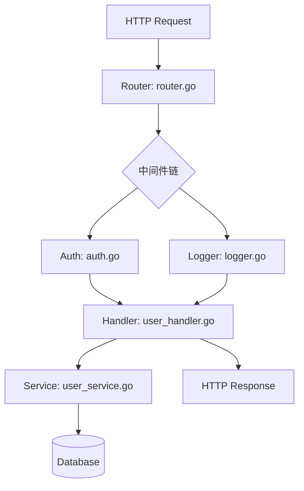
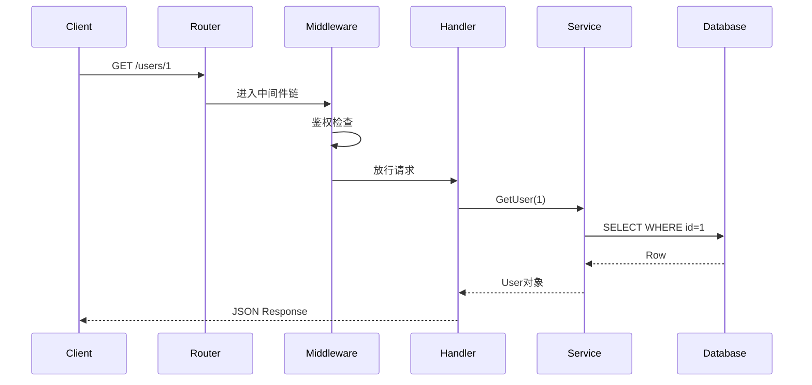
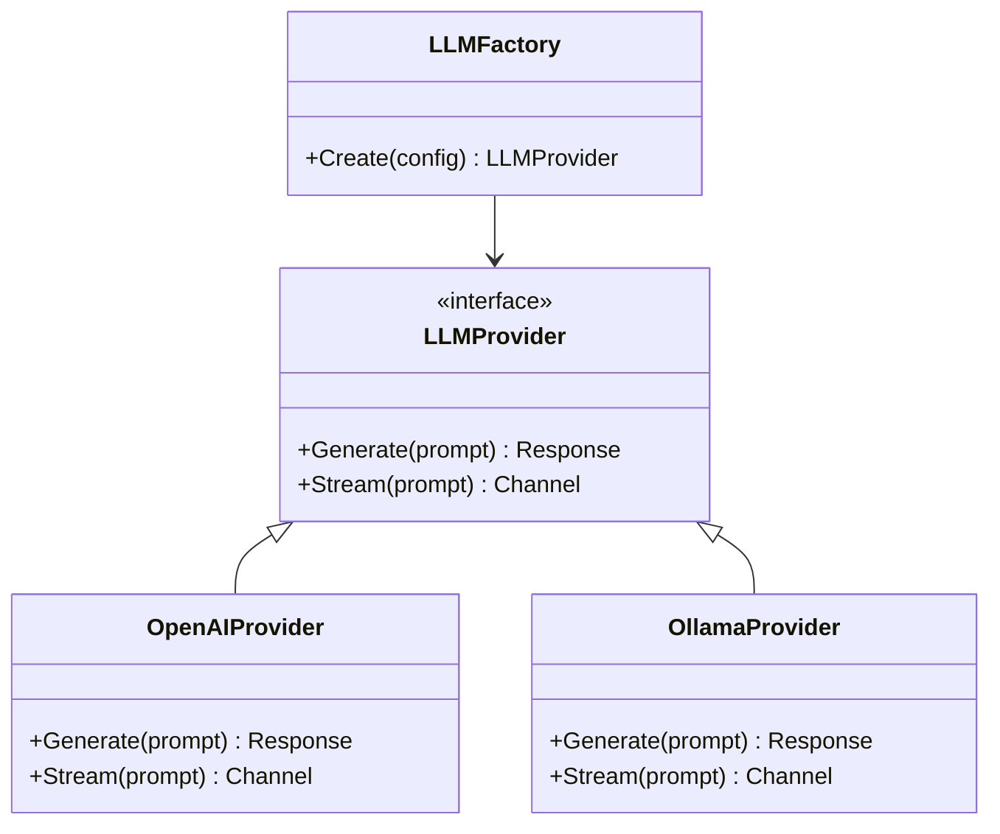
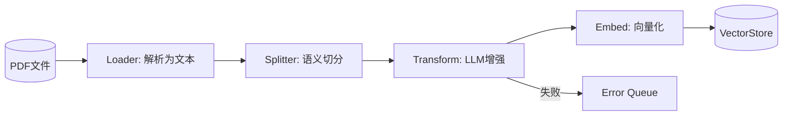
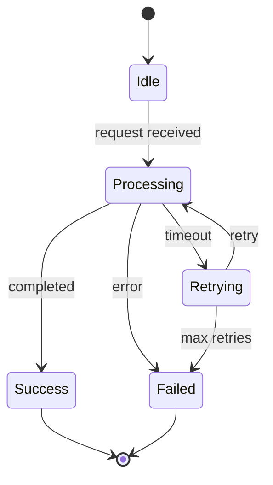

# Mermaid 图表使用指南

在课程文件中需要用 Mermaid 图表可视化架构和调用关系。不同场景适合不同类型的图。

---

## `graph TD` — 架构调用流（最常用）

**适用场景**：展示模块间的依赖关系和调用方向。用于**整体架构图**和**每课的局部调用关系图**。

**绘制要点**：
- 节点用 `[标签]` 描述模块名 + 文件名，如 `A[Router: router.go]`
- 边用 `-->` 表示调用关系，`-->|label|` 加边标签
- 用 `{菱形}` 表示分支点
- 用 `[(圆柱)]` 表示数据存储

**示例**：

---

## `sequenceDiagram` — 请求/响应时序追踪

**适用场景**：追踪一次完整请求中各模块的调用时序。用于**讲解核心流程**时展示调用顺序和消息传递。

**绘制要点**：
- `participant` 声明参与者
- `A->>B: message` 表示同步调用
- `A-->>B: message` 表示返回
- `Note over A,B: text` 添加跨参与者的注释

**示例**：

---

## `classDiagram` — 模块/接口关系

**适用场景**：展示核心接口定义和实现关系。用于**讲解抽象设计**时说明多态和依赖注入。

**绘制要点**：
- `class` 定义类/接口
- `<|--` 表示继承/实现
- `*--` 表示组合（强依赖）
- `o--` 表示聚合（弱依赖）

**示例**：

---

## `flowchart LR` — 数据流/管道处理

**适用场景**：展示数据在各个处理阶段之间的流转。用于**讲解 Pipeline/ETL** 流程。

**绘制要点**：
- `LR` (left-right) 方向更适合横向流程
- 用 `subgraph` 对相关步骤分组
- 用不同形状区分输入/处理/输出

**示例**：

---

## `stateDiagram` — 状态机/生命周期

**适用场景**：展示对象的状态变迁。用于**讲解生命周期管理**（连接池状态、任务状态、会话状态）。

**绘制要点**：
- `[*]` 表示起点/终点
- `state "描述" as ID` 声明状态
- `A --> B: trigger` 表示状态转移

**示例**：

---

## 选择指南

| 你要展示什么 | 用哪种图 |
|-------------|---------|
| 模块间谁调用谁、静态依赖关系 | `graph TD` |
| 一次请求/调用的时间顺序、消息传递 | `sequenceDiagram` |
| 接口继承、实现关系、类的组合 | `classDiagram` |
| 数据经过哪些处理阶段、管道流 | `flowchart LR` |
| 状态如何变化、生命周期 | `stateDiagram` |

**默认选择**：如果不确定，用 `graph TD`，它是最通用的。
